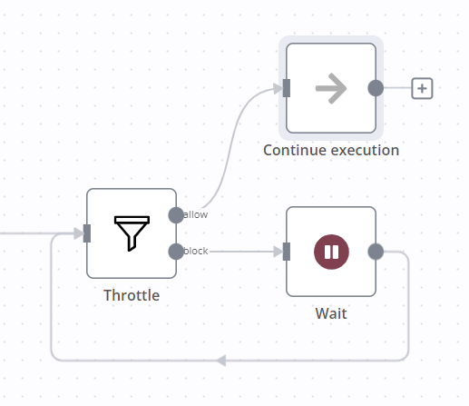
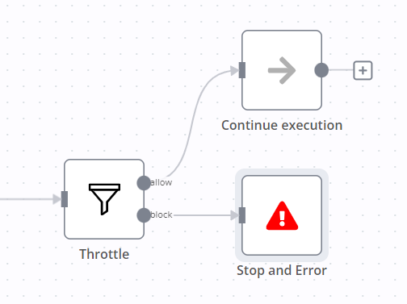

#  n8n-nodes-throttle

This is an n8n community node. It lets you to throttle the execution of workflows.

It provides a `Throttle` note that routes items either to the `Allowed` or `Blocked` output depending on the configured throttling timeout.

> **Note:** This node will only block executions if workflow is triggered by a webhook or any other automated trigger.  
It will allow all executions if the workflow is triggered manually.  
This is due to N8N internal restrictions.

## Table of Contents

* [Use cases](#use-cases)
* [Installation](#installation)  
* [Operations](#operations)  
* [Usage](#usage)
* [Version history](CHANGELOG.md)  

## Use cases

It could be combined with `Wait` node to retry the execution of the workflow after some time:

Or it could be combided with `Error` node to terminate the workflow execution.

## Installation

Follow the [installation guide](https://docs.n8n.io/integrations/community-nodes/installation/) in the n8n community nodes documentation.

